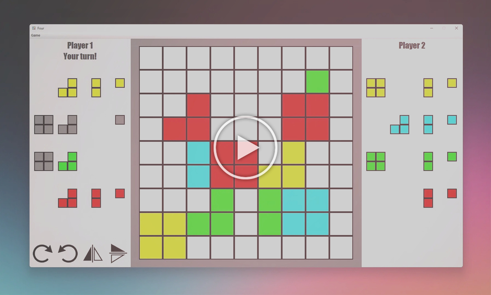

# The Four Game

**Overview**

This project was completed as part of COMP 2005 coursework at Memorial University of Newfoundland. The Four Game Project is a computerized adaptation of the "Four" board game, designed to increase accessibility and enjoyment by offering features such as AI opponents, game saving/loading, and support for players with color vision deficiency. The digital version aims to broaden the game's reach, making it suitable for a diverse audience including children and those with accessibility needs.

**Please click on the thumbnail to view the demo. 👇**

 

**Note on Code Sharing:**
- In accordance with academic integrity policies, the complete source code is not publicly available. Screenshots and code snippets have been modified to comply with university guidelines while still demonstrating the project's functionality and design.
 

**Technologies Used**
- Java
- Java Swing for GUI components
- Object-Oriented Design Patterns
 

**Our Approach**

The development of our Four Game project followed a structured, iterative approach divided into four one-week iterations. This methodology allowed us to progressively build functionality while maintaining quality and addressing risks throughout the development lifecycle.

 

**Iteration Structure**
Our development process was organized as follows

 

***Iteration 1: Foundation and Planning***

- Created initial user interface design
- Developed Fully Dressed Use Case Descriptions for core gameplay:
- Setting up the game
- Player Taking Turns
- Constructed a comprehensive domain model
- Finalized the vision document outlining project scope and goals

 

***Iteration 2: Core Implementation***
- Coded elements from Iteration 1, resulting in minor releases V1 and V2
- Developed a functional prototype
- Created additional Use Case Descriptions:
- Choose player settings
- Rotate and flip a piece
- Produced sequence diagrams for visualization of interactions
- Developed class diagram to structure code architecture

 

***Iteration 3: Feature Enhancement***
- Upgraded the game to include Iteration 2 functionalities (released as V3)
- Focused on user experience elements:
- Choose display settings functionality
- Place a piece functionality
- Created corresponding sequence diagrams and Use Case Descriptions

 

***Iteration 4: Finalization and Quality Assurance***
- Implemented all remaining elements from Iteration 3
- Achieved fully functional game status
- Conducted thorough JUnit testing for quality assurance
- Created networking documentation
- Documented design patterns implemented in the codebase
- Applied minor refinements based on testing feedback
- Released final version of the game

 

This incremental approach enabled us to manage project risks effectively while maintaining steady progress toward our vision of creating an accessible digital version of the Four board game with enhanced features and accessibility options.

 

**User Goals**

    - Start new games, choose modes and AI difficulty, save/load progress, view rules
    - Access color-blind mode
    - Use simplified instructions for kids2

 

**System Features**

    - Human vs. human and human vs. AI modes
    - Easy/Hard AI difficulty
    - Save/load game
    - Color-blind mode
    - Runs on a single machine/terminal
    - Simplified instructions
    - Follows original game rules

 

**System Features**

    - Building good AI for two levels
    - Designing effective color-blind mode
    - Implementing robust save/load
    - Ensuring rules are followed
    - Managing schedules and iterations

 

**Accessibility and Optimization**

We designed the Four Game to be accessible and efficient for all users. The game includes a color-blind mode and clear instructions to support diverse players. It is optimized to run smoothly on most systems, ensuring quick load times and responsive gameplay for an enjoyable experience.

 

**Conclusion**

The Four Game Project represents more than just a digital adaptation of a classic board game-it’s a leap toward inclusive, accessible, and modern gameplay for everyone. By transforming the traditional experience with smart AI, color-blind support, and flexible play modes, we are opening the doors for players of all backgrounds and abilities to connect, compete, and enjoy strategic fun wherever they are. Our iterative, user-focused approach ensures that the final product is not only robust and feature-rich, but also welcoming and engaging for a diverse audience. With this project, we’re not just preserving the spirit of “Four”-we’re reimagining it for a new generation of players.

 
